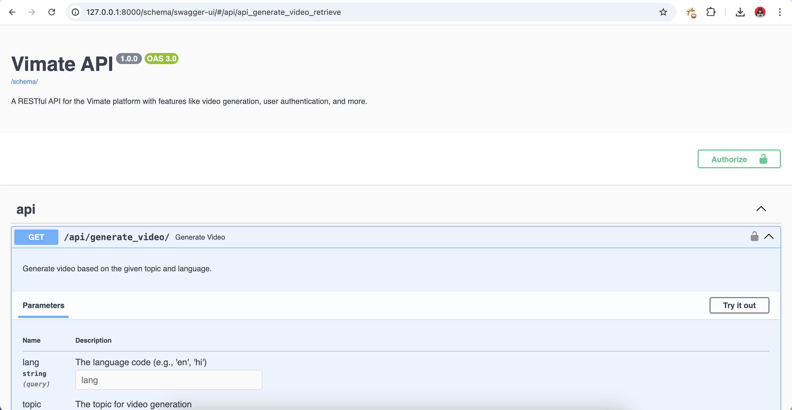
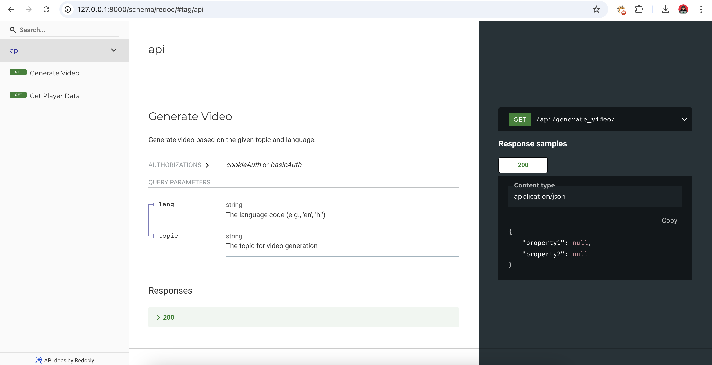

# Vimate


## Technologies Used
- Frontend
    - React.js 
    - Tailwind
    - Clerk SDK
- Backend
    - Django
    - Django Restful
    - Celery 
    - Redis
    - ElevenLabs (**Voice Generation**)
    - Stable Diffusion (**Open Source LLM**)
    - Mistral 7b (**Open Source LLM**)
    - Clerk (**Seamless Secure Oauth**)

## Backend Installation (Django Restful)
```
sudo apt install redis-server nginx python3-pip -y
sudo systemctl start redis-server
sudo systemctl enable redis-server
sudo service redis-server status 

python3 -m venv venv
source venv/bin/activate
cd backend
pip install -r requirements.txt
# Create .env file, refer env-sample file
python3 manage.py runserver
```

## Backend API Documentations
- [Swagger UI Documentation Link](http://127.0.0.1:8000/schema/swagger-ui/)


- [Swagger Redoc Documentation Link](http://127.0.0.1:8000/schema/redoc/#tag/api)


## Frontend (React.js)
```
cd frontend
npm i
# Create .env file, refer env-sample file
npm run dev
```